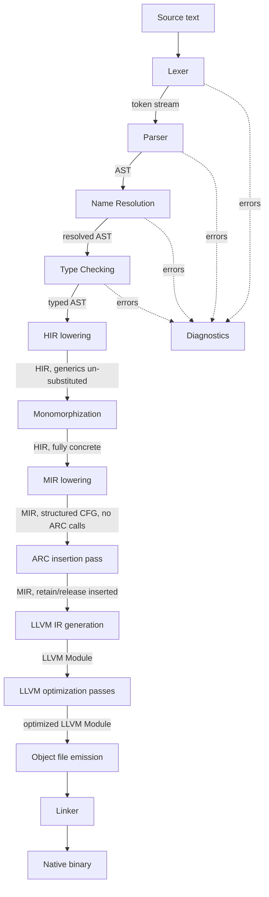
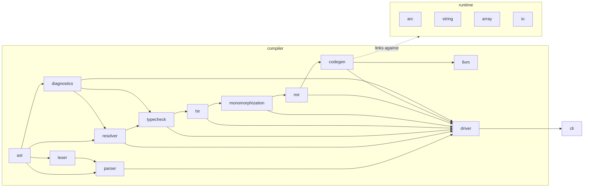

# Nether Compiler — Architecture Overview

This document describes the implemented compilation pipeline, why each
stage exists, and how the crates in the repository map onto it. Per-crate
detail (public API, invariants, extension points) lives
in [`crates.md`](./crates.md). The type representation lives in
[`type-system.md`](./type-system.md). The ARC insertion pass is detailed in
[`arc-model.md`](./arc-model.md). The language rules themselves live in
[`../spec/language-spec.md`](../spec/language-spec.md).

## 1. Why HIR *and* MIR, not just AST → LLVM IR

It would be possible to generate LLVM IR directly from a type-checked AST.
Nether deliberately does not, for the same reason rustc doesn't:

- **AST** is a direct, lossy-free mirror of source syntax (it still has
  parentheses, `if`/`else` as one shape, method-call sugar, etc.) — good for
  diagnostics anchored to source spans, bad for uniform analysis.
- **HIR** (High-level IR) is the AST after name resolution and type
  checking have run: identifiers are resolved to concrete declarations,
  every expression carries a type, syntactic sugar is desugared to a
  smaller set of node kinds, but control flow is still structured
  (`if`/`match`/loops as nested expressions, not basic blocks). This is
  where generic definitions still exist in un-monomorphized, single-copy
  form.
- **Monomorphization** walks HIR from call sites and produces one
  concrete, fully-substituted copy per generic instantiation. This has to
  happen *before* MIR because MIR's ARC insertion pass needs to know the
  concrete heap-vs-stack classification (§3.3 of the spec) of every value,
  which is only known once generic parameters are substituted.
- **MIR** (Mid-level IR) lowers structured control flow into an explicit
  control-flow graph of basic blocks with a small, fixed set of
  instructions. This is the level at which retain/release calls are a
  well-defined, mechanical pass (walk the CFG, insert calls at scope
  exits, calls, and returns) — doing the same insertion directly on
  tree-shaped HIR would require re-deriving control-flow/liveness
  information inline with every other pass, forever. Keeping MIR separate
  means the ARC pass, and later optimizations, have one shared, stable
  substrate instead of each re-deriving CFG facts.
- **LLVM IR generation** from MIR is then a close-to-mechanical
  translation: MIR basic blocks become LLVM basic blocks, MIR instructions
  become LLVM instructions/intrinsic calls, and ARC retain/release calls
  become calls into the runtime's `arc` module.

Skipping HIR or MIR "because the MVP is simple" would look attractive for a
week and cost years: every later feature (better inlining, escape analysis
to elide retains, alternate backends) needs a stable, control-flow-graph
-shaped IR to operate on, and retrofitting one under production code is far
more expensive than building it from day one at small scale.

## 2. Pipeline diagram

Every stage from Lexer through Type Checking can emit diagnostics; later
stages (HIR onward) assume the program is already well-formed and
well-typed, and treat any internal inconsistency as a compiler bug (an
`ICE`), not a user-facing diagnostic. This mirrors rustc's split between
"the user can still have gotten this wrong" (front end) and "if this is
wrong, we have a compiler bug" (middle/back end).

## 3. Crate dependency graph

Dependencies flow strictly one direction (left/top → right/bottom in the
diagram above): a crate never depends on something later in the pipeline.
`diagnostics` and `ast` are the two crates everything else is allowed to
depend on freely, since they carry no pipeline-stage-specific logic.
`runtime` is not linked into the compiler process at all — it is a
separate set of crates compiled to a static library that the *output
binary* links against; `codegen` only needs to know the runtime's C-ABI
function signatures (declared, not defined, in `codegen`/`llvm`).

## 4. Stage-by-stage responsibilities

1. **Lexer** (`lexer`) — source text → token stream. Owns all
   character-level decisions: comment stripping, string/template-string
   scanning (including the `${` interpolation split, per spec §2.3),
   numeric literal scanning. Produces `Span`-tagged tokens; never
   allocates AST nodes.
2. **Parser** (`parser`) — token stream → `ast`. Pratt parser for
   expressions (per the operator-precedence needs of a C-like/Rust-like
   grammar); recursive-descent for items/statements. Purely syntactic —
   does not resolve names or check types. Produces one AST node kind for
   dotted paths (module path vs. member access is not decided here, per
   spec §10).
3. **Name Resolution** (`resolver`) — walks the AST, builds scopes, binds
   every identifier/path to a concrete declaration (or reports an
   unresolved-name diagnostic). This is the stage that disambiguates the
   dotted-path node from §10 into "module segment" vs. "value/static
   access" by looking up each segment.
4. **Type Checking** (`typecheck`) — assigns a structured `Type` (never a
   string — see `type-system.md`) to every expression, checks interface
   bounds are satisfied, checks `mut`/heap-vs-stack rules are respected
   (e.g. a `mut` parameter's argument must itself be a `mut` binding, per
   spec §5.1).
5. **HIR lowering** (`hir`) — desugars the typed AST into a smaller,
   uniform node set: e.g. `for` loops desugar to their underlying
   iteration primitive, string interpolation desugars to concatenation
   calls, tuple-struct construction desugars to the same shape as
   struct-literal construction. Generic items are still generic here (one
   copy per generic `fn`/`type`/`impl`).
6. **Generic Monomorphization** (`monomorphization`) — starting from
   `main` and all non-generic items, walks call sites; for every distinct
   concrete instantiation of a generic item, produces one fully
   substituted HIR copy. Output HIR has zero remaining type parameters.
7. **MIR lowering** (`mir`) — lowers structured HIR control flow
   (`if`/`match`/loops as expressions) into an explicit CFG of basic
   blocks with a small fixed instruction set (assign, call, branch,
   switch, return). This is also where heap-vs-stack classification
   becomes an explicit per-value fact attached to each MIR local, since
   it's now needed mechanically by the next pass.
8. **ARC insertion pass** (`mir`, as a distinct pass over MIR — see
   `arc-model.md`) — walks the CFG and inserts explicit
   retain/release/RVO-elision calls per the rules in spec §13. Runs
   entirely on MIR, never on HIR or AST, so it only has to reason about a
   CFG + a fixed instruction set, not arbitrary nested expression trees.
9. **LLVM IR Generation** (`codegen`, using the `llvm` backend-abstraction
   crate) — translates ARC-annotated MIR into an LLVM `Module`: basic
   blocks, instructions, and calls into the runtime's C-ABI functions
   (`nether_rt_arc_retain`, etc.). This is the *only* crate that touches
   `inkwell`/`llvm-sys` directly (see §5, backend abstraction).
10. **LLVM Optimization** — the selected LLVM pass pipeline runs before
    object emission. The CLI/API selects `O0` through `O3`; `O0` is the
    default.
11. **Object File emission** — LLVM's selected target machine emits a
    native object file; the CLI accepts `--target <llvm-triple>`.
12. **Linker** — invokes the system linker (`cc`/`ld` via the platform
    toolchain) to link the object file(s) against the `runtime` static
    library and produce the final native binary.

## 5. Backend abstraction

LLVM does not leak into `mir`, `monomorphization`, or anything upstream of
`codegen`. The `llvm` crate owns Inkwell and exposes the concrete
`Codegen`/`ModuleCx` facade used by `codegen`. This is a narrow abstraction
boundary, not a backend trait. A future non-LLVM backend would provide a
sibling codegen implementation over the same MIR.

## 6. Diagnostics architecture

`diagnostics` defines `SourceMap`, `Span`, `Diagnostic`, `Label`, `Hint`, and
`Suggestion`, independent of any single pipeline stage, so every stage from
`lexer` through `typecheck` reports through the same types. A `Diagnostic`
carries one or more `Label`s (each a `Span` + message, e.g. "expected `;`
here"), optional `Hint`s (plain-text explanation), and optional
`Suggestion`s (a machine-applicable source rewrite). `SourceMap` maps byte
offsets back to file/line/column for rendering, so every crate upstream of
`typecheck` only ever needs to carry `Span`s, not line/column pairs,
through its own logic.

## 7. Testing architecture

Each crate owns tests for its stage: lexer token streams, parser AST
shapes, resolver bindings, type-checker accept/reject cases, HIR
desugaring, monomorphization, MIR/ARC and LLVM verification. Driver
integration tests compile, link and execute representative programs,
exercise multi-file namespaces and stdlib loading, validate diagnostics
and compile options, and compile every file under `examples/`.

## 8. Current maturity boundary

The end-to-end native pipeline is implemented. The compiler is an
experimental alpha/MVP rather than a production toolchain: it has no
package manager or incremental compilation, imports have no aliases,
generics intentionally omit where-clauses/associated types/specialization,
the standard library is small, enums use a space-inefficient flat layout,
and linking is host-only (cross-target object emission is supported).
